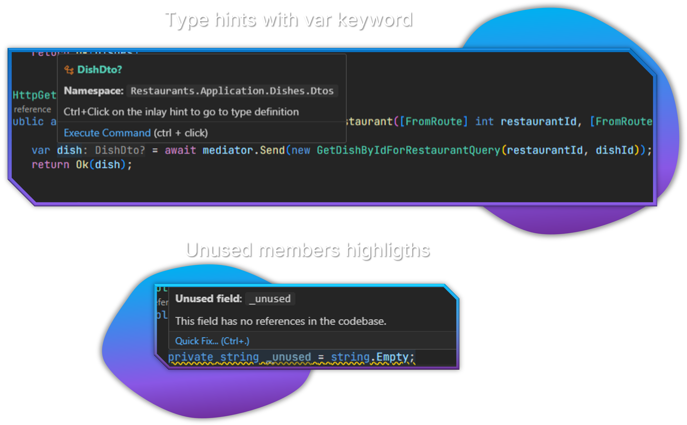

# Code Analysis Features

Enhance your coding experience with intelligent code analysis features designed specifically for C# development.



## Overview

C# Dev Tools provides several code analysis features that help you write better code:

- Unused symbol highlighting
- Type inlay hints
- Enhanced navigation

These features integrate with the C# language server to provide real-time feedback as you code.

## Unused Symbol Highlighting

Identify and eliminate dead code with unused symbol highlighting.

### How It Works

The extension automatically detects and highlights unused:

- Private methods
- Properties (public and private)
- Fields (public and private)
- Events (public and private)

Unused symbols appear with reduced opacity (greyed out), making it easy to identify code that's not being used.

### Configuring Unused Symbol Highlighting

You can customize this feature in VS Code settings:

1. Open VS Code settings (`Ctrl+,`)
2. Search for "csharp-dev-tools.editor.highlightUnusedSymbols" to enable/disable the feature
3. Search for "csharp-dev-tools.editor.unusedSymbolOpacity" to adjust the opacity level (0.1-1.0)

### Toggling the Feature

To quickly toggle unused symbol highlighting:

1. Open the Command Palette (`Ctrl+Shift+P`)
2. Type "C# Solution Explorer: Toggle Unused Symbol Highlighting"
3. Press Enter to toggle the feature on or off

### How Symbols Are Detected

The extension uses multiple detection methods:

1. **Primary Method**: Utilizes C# language server diagnostics (IDE0051 and similar)
2. **Fallback Method**: Reference counting for larger files
3. **Performance Optimized**: Only detects usage within the file context
4. **Public Method Exclusion**: Public methods are excluded from detection as they might be API endpoints or library methods

## Type Inlay Hints

See inferred types for `var` declarations directly in your code.

### How Type Hints Work

When you use the `var` keyword in C#, type inlay hints display the actual inferred type:

```csharp
var customer = new Customer(); // var: Customer
var age = 42; // var: int
var items = GetItems(); // var: List<Item>
```

This helps maintain the convenience of `var` while preserving type clarity.

### Configuring Type Hints

Control this feature through settings:

1. Open VS Code settings (`Ctrl+,`)
2. Search for "csharp-dev-tools.inlayHints.enableTypeHints" to enable/disable the feature
3. Search for "csharp-dev-tools.inlayHints.enableParameterHints" to enable/disable parameter name hints

### Customizing Type Hint Appearance

You can customize the color of type hints:

1. Open VS Code settings (`Ctrl+,`)
2. Search for "csharpStuff.inlayHints.typeColor"
3. Click "Edit in settings.json"
4. Customize the color values for different themes

### Toggling Type Hints

To quickly toggle type inlay hints:

1. Open the Command Palette (`Ctrl+Shift+P`)
2. Type "C# Solution Explorer: Toggle C# Type Inlay Hints"
3. Press Enter to toggle the feature on or off

## Navigation Enhancements

The extension provides several navigation improvements:

### Reveal in Solution Explorer

Quickly locate the current file in the Solution Explorer:

1. Press `Shift+Alt+L` when a file is open
2. The Solution Explorer will expand and highlight the current file
3. This works with any file in your solution

### Solution Structure Navigation

Navigate your codebase through the structured Solution Explorer:

1. View logical project organization rather than just file system structure
2. Navigate through project references and dependencies
3. Quickly access related files through the hierarchical view

## Integration with VS Code Problems Panel

Code analysis features integrate with VS Code's Problems panel:

1. Errors and warnings detected in C# files appear in the Problems panel
2. Click on issues to navigate directly to the relevant code
3. See detailed descriptions of detected problems

## Performance Considerations

The code analysis features are designed to be lightweight:

1. Analysis runs incrementally as files change
2. Large files have optimized analysis to prevent slowdowns
3. Features can be toggled individually if performance issues arise

## Limitations

Be aware of these limitations:

1. Unused symbol detection works best on private methods and properties
2. Public API methods may be incorrectly marked as unused if references are outside the analyzed scope
3. Type inlay hints depend on the C# language server's type inference capabilities
4. Very large files may have delayed analysis results
