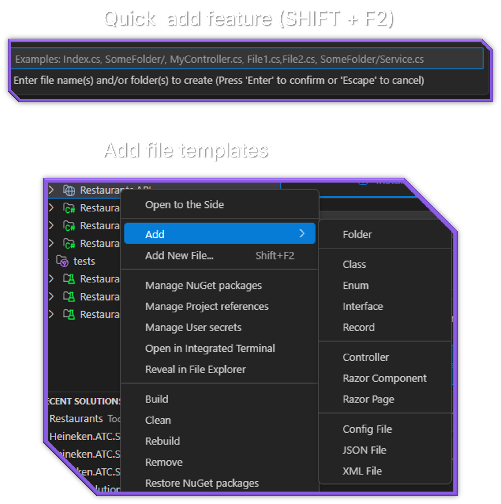

# Project and File Templates

Create new projects and add files with built-in templates designed for .NET development.



## Overview

C# Dev Tools includes a comprehensive set of templates for:

- Creating new .NET projects
- Adding files to existing projects
- Generating common C# code constructs
- Creating web development components

## Project Templates

### Creating a New Project

1. Right-click on a solution or solution folder in the Solution Explorer
2. Select **Add > New Project**
3. Browse the available project templates
4. Select a template and configure the options:
   - Project name
   - Location
   - Framework target
   - Other template-specific options
5. Click "Create" to generate the project

### Available Project Templates

C# Dev Tools supports all standard .NET templates:

- **Console Application**
- **Class Library**
- **ASP.NET Core Web App**
- **ASP.NET Core Web API**
- **Blazor Server/WebAssembly App**
- **WPF Application**
- **Windows Forms Application**
- **Unit Test Project**
- And many more

## File Templates

### Adding Files to Projects

Quick Add (Recommended):

1. Select a project or folder in the Solution Explorer
2. Press `Shift+F2` to open the Quick Add dialog
3. Choose a template from the list
4. Enter a name for the file
5. Click "Create" to generate the file

Context Menu:

1. Right-click on a project or folder in the Solution Explorer
2. Navigate to **Add** and select the type of file to create
3. Enter a name for the file
4. Click "Create" to generate the file

### C# Code Templates

The following C# code templates are available:

#### Class Template

Creates a new C# class with:

- Proper namespace based on folder structure
- Optional constructor
- Standard formatting following C# conventions

```csharp
namespace YourProject.YourNamespace
{
    public class YourClass
    {
        public YourClass()
        {
            
        }
    }
}
```

#### Interface Template

Creates a new C# interface with proper naming conventions:

```csharp
namespace YourProject.YourNamespace
{
    public interface IYourInterface
    {
        
    }
}
```

#### Enum Template

Creates a new enum type:

```csharp
namespace YourProject.YourNamespace
{
    public enum YourEnum
    {
        Value1,
        Value2,
        Value3
    }
}
```

#### Record Template

Creates a modern C# record type:

```csharp
namespace YourProject.YourNamespace
{
    public record YourRecord(string Property1, int Property2);
}
```

### Web Development Templates

#### Controller Template

Creates an ASP.NET Core API controller:

```csharp
using Microsoft.AspNetCore.Mvc;

namespace YourProject.Controllers
{
    [ApiController]
    [Route("[controller]")]
    public class YourController : ControllerBase
    {
        [HttpGet]
        public IActionResult Get()
        {
            return Ok("Controller created successfully");
        }
    }
}
```

#### Razor Page Template

Creates a Razor Page with its code-behind file:

```html
@page
@model YourProject.Pages.YourPageModel

<h1>Your Page</h1>

<p>This is a new Razor Page.</p>
```

#### Razor Component Template

Creates a Blazor component:

```html
@namespace YourProject.Components

<div class="your-component">
    <h2>@Title</h2>
    
    <p>This is a new Blazor component.</p>
</div>

@code {
    [Parameter]
    public string Title { get; set; } = "Your Component";
}
```

### Configuration Templates

#### JSON File Template

Creates a structured JSON file:

```json
{
  "setting1": "value1",
  "setting2": "value2",
  "nestedSettings": {
    "nestedSetting1": "nestedValue1"
  }
}
```

#### XML File Template

Creates an XML file with standard structure:

```xml
<?xml version="1.0" encoding="utf-8" ?>
<root>
  <item>
    <name>Item 1</name>
    <value>Value 1</value>
  </item>
</root>
```

#### Config File Template

Creates an appsettings.json style configuration file:

```json
{
  "Logging": {
    "LogLevel": {
      "Default": "Information",
      "Microsoft": "Warning",
      "Microsoft.Hosting.Lifetime": "Information"
    }
  },
  "AllowedHosts": "*",
  "ConnectionStrings": {
    "DefaultConnection": "Your connection string here"
  }
}
```

## Smart Features

### Automatic Namespace Generation

File templates automatically determine the appropriate namespace based on:

1. The project's root namespace (from .csproj file)
2. The folder structure within the project
3. Standard .NET naming conventions

### Customizing Templates

While C# Dev Tools doesn't yet support custom templates, you can influence the generated files:

1. File naming conventions are respected (e.g., "IInterface" for interfaces)
2. The selected location determines the namespace
3. The project type influences available templates

## Next Steps After Creating Files

After creating a file from a template:

1. The file opens automatically in the editor
2. Key sections that typically need customization are highlighted
3. You can immediately begin editing the file to implement your specific functionality
