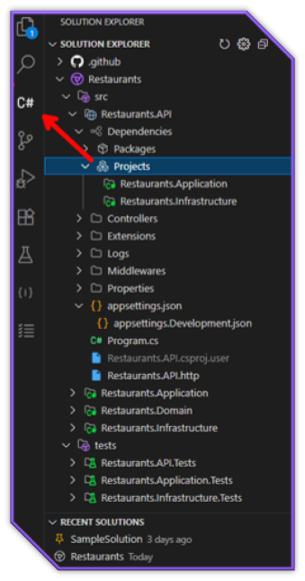

# Solution Explorer

The Solution Explorer is a core feature of C# Dev Tools, providing a Visual Studio-like experience for managing .NET projects.

## Overview

The Solution Explorer gives you a complete hierarchical view of your .NET solution, including:

- Solution files and properties
- Projects and project references
- Solution folders
- File system folders and files
- Dependencies (NuGet packages and project references)

## Basic Navigation

- **Expand/Collapse**: Click the arrow icons to expand or collapse items
- **Open Files**: Double-click on a file to open it in the editor
- **Select Multiple Items**: Use Ctrl+Click or Shift+Click to select multiple items
- **Context Menu**: Right-click on items to see available actions

## Managing Solutions

### Opening Solutions

The Solution Explorer will automatically load the first .sln file found in your workspace. If you have multiple solutions:

1. Click the Solution Explorer icon in the Activity Bar
2. Use the dropdown at the top of the Solution Explorer to switch between solutions

### Creating a New Solution

1. Click the "Create New Solution" button in the Solution Explorer title bar
2. Enter a name and location for your solution
3. Select an initial project template if desired
4. Click "Create" to generate the solution

## Working with Projects

### Adding a New Project

1. Right-click on the solution or a solution folder
2. Select **Add > New Project**
3. Choose a project template
4. Configure the project options and click "Create"

### Adding an Existing Project

1. Right-click on the solution or a solution folder
2. Select **Add > Existing Project**
3. Navigate to the project file (.csproj, .fsproj, etc.)
4. Click "Open" to add the project to the solution

### Setting a Startup Project

1. Right-click on an executable project
2. Select **Set as Startup Project**
3. The project name will appear in bold in the Solution Explorer

### Building Projects

Right-click on a project or the solution and select one of:

- **Build**: Build the selected item
- **Rebuild**: Clean and build the selected item
- **Clean**: Remove build artifacts

## Managing Files and Folders

### Adding Items

Quick Add:

1. Select a project or folder in the Solution Explorer
2. Press `Shift+F2` to open the Quick Add dialog
3. Choose a template and provide a name

Context Menu:

1. Right-click on a project or folder
2. Navigate to **Add** and select the item type
3. Enter a name for the new item

### Organizing Items

- **Create Folder**: Right-click and select **Add > Folder**
- **Move Items**: Drag and drop items to new locations
- **Copy/Paste**: Use the context menu or keyboard shortcuts (`Ctrl+C`, `Ctrl+X`, `Ctrl+V`)
- **Rename**: Select an item, press `F2`, and enter a new name
- **Delete**: Select an item, press `Delete`, and confirm the deletion

## Dependencies Management

### NuGet Packages

1. Right-click on a project or the solution
2. Select **Manage NuGet Packages**
3. Use the NuGet Package Manager to add, update, or remove packages

### Project References

1. Right-click on a project
2. Select **Manage Project References**
3. Check the projects you want to reference
4. Click "OK" to add the references

## User Secrets

For projects that support user secrets:

1. Right-click on a project
2. Select **Manage User Secrets**
3. Edit the secrets.json file that opens

## Advanced Features

### File Path Operations

Right-click on an item and select:

- **Copy Path**: Copy the full path to the clipboard
- **Copy Relative Path**: Copy the path relative to the workspace
- **Reveal in File Explorer**: Open the item's location in File Explorer
- **Open in Integrated Terminal**: Open a terminal at the item's location

### Active File Tracking

The Solution Explorer can automatically highlight the currently active file:

1. Open VS Code settings
2. Search for "csharp-dev-tools.solutionViewer.trackActiveFile"
3. Toggle the setting as desired

You can also press `Shift+Alt+L` to reveal the current file in the Solution Explorer at any time.
