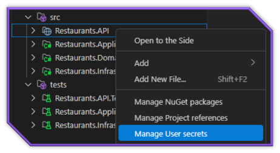

# User Secrets Management

Securely manage sensitive configuration data for your .NET projects.



## Overview

The User Secrets Management feature allows you to:

- Store sensitive configuration data outside of your source code
- Manage secret values like connection strings, API keys, and credentials
- Integrate with ASP.NET Core's user secrets mechanism
- Avoid accidentally committing sensitive data to source control

## What are User Secrets?

User secrets is a secure way to store private configuration data for .NET projects during development. It stores this data in a JSON file outside your project directory, ensuring sensitive information doesn't get committed to source control.

The secrets are stored in:

- Windows: `%APPDATA%\Microsoft\UserSecrets\<user_secrets_id>\secrets.json`
- macOS/Linux: `~/.microsoft/usersecrets/<user_secrets_id>/secrets.json`

## Accessing User Secrets

To access the User Secrets Manager:

1. Right-click on a project in the Solution Explorer
2. Select **Manage User Secrets**
3. If the project doesn't have user secrets configured yet, you'll be prompted to initialize them
4. Once initialized, the `secrets.json` file will open in the editor

## Managing Secrets

### Adding Secrets Manually

1. Open the User Secrets Manager as described above
2. Edit the JSON file to add your secrets:

```json
{
  "ConnectionStrings:DefaultConnection": "Server=myserver;Database=mydb;User Id=myuser;Password=mypassword;",
  "ApiKeys:ServiceName": "your-api-key-here",
  "Authentication:Provider:ClientId": "client-id",
  "Authentication:Provider:ClientSecret": "client-secret"
}
```

Then save the file to update your secrets

### Using Templates

C# Dev Tools provides templates for common secret patterns:

1. Right-click on a project in the Solution Explorer
2. Select **Manage User Secrets**
3. In the User Secrets Editor, you'll see a toolbar with template options
4. Select from templates like:
   - **Add Connection String Example**
   - **Add API Key Example**
   - **Add Custom Secret**

### Removing Secrets

To remove a secret:

1. Open the User Secrets Manager
2. Delete the relevant JSON property
3. Save the file

## Accessing Secrets in Code

To access user secrets in your .NET application:

### ASP.NET Core

In `Program.cs`:

```csharp
var builder = WebApplication.CreateBuilder(args);

// User secrets are automatically loaded in Development environment
if (builder.Environment.IsDevelopment())
{
    builder.Configuration.AddUserSecrets<Program>();
}
```

Then access the values:

```csharp
var connectionString = builder.Configuration.GetConnectionString("DefaultConnection");
var apiKey = builder.Configuration["ApiKeys:ServiceName"];
```

### Console Applications

For non-web applications, add the `Microsoft.Extensions.Configuration.UserSecrets` NuGet package and:

```csharp
var configuration = new ConfigurationBuilder()
    .AddUserSecrets<Program>()
    .Build();

var secretValue = configuration["SecretName"];
```

## User Secrets ID

Each project using user secrets has a unique ID stored in the project file:

```xml
<PropertyGroup>
  <UserSecretsId>aspnet-YourProject-12345678-1234-1234-1234-123456789012</UserSecretsId>
</PropertyGroup>
```

C# Dev Tools automatically:

1. Generates this ID when initializing user secrets
2. Adds it to your project file
3. Creates the necessary directory structure

## Best Practices

When working with user secrets:

1. **Never commit sensitive data** to source control
2. Use user secrets for development only, not production
3. Use environment variables or a secure service like Azure Key Vault for production secrets
4. Structure secrets with hierarchical paths using `:` separator for better organization
5. Include placeholder values in appsettings.json as documentation
6. Use specific secret names to avoid conflicts

## Production Environments

User secrets are intended for development only. For production environments:

1. Use environment variables
2. Use a secure secret management service like:
   - Azure Key Vault
   - AWS Secrets Manager
   - HashiCorp Vault
3. Configure your application to use these services in production

## Learning More

To learn more about user secrets:

1. Right-click on a project in the Solution Explorer
2. Select **Manage User Secrets**
3. Click **Learn About User Secrets** in the toolbar
4. This will open Microsoft's official documentation on user secrets
