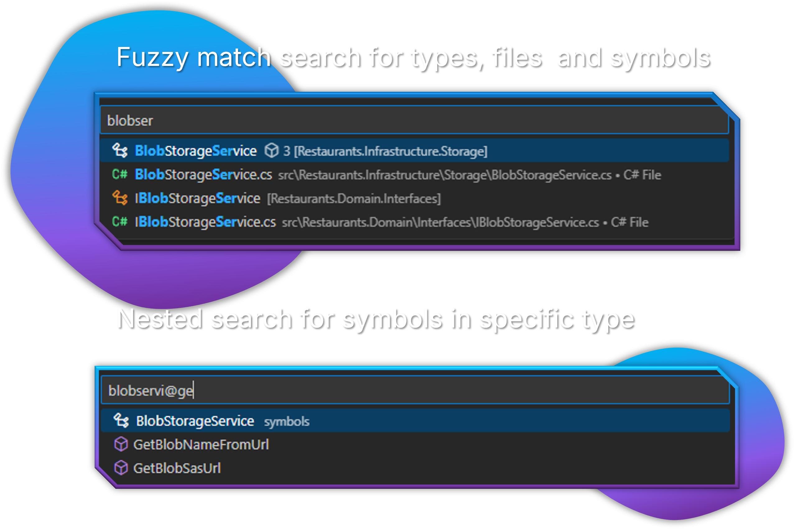

# Advanced Search

Powerful search capabilities to find code, files, and symbols across your entire solution.



## Overview

The Advanced Search feature lets you quickly find and navigate to:

- Classes, interfaces, structs, records, and enums
- Methods, properties, fields, and events
- Constants and enum values
- Namespaces and other symbols

This feature is especially valuable in large codebases where traditional file search is too slow or imprecise.

## Opening Advanced Search

There are multiple ways to access Advanced Search:

- Press `Alt+P` (default keyboard shortcut)
- Use the Command Palette (`Ctrl+Shift+P`) and type "Advanced Search: Types & Symbols"
- Click the search icon in the Solution Explorer title bar

## Search Syntax

Advanced Search offers several search modes:

### Type Search

To search for types (classes, interfaces, etc.), simply type the name:

```text
Customer
```

This will find all types with "Customer" in their name.

### Member Search

To search for members within any type, use the `@` syntax:

```text
@AddItem
```

This will find all members named "AddItem" across all types.

### Scoped Member Search

To find members within a specific type, combine both approaches:

```text
ShoppingCart@AddItem
```

This will find methods named "AddItem" within types named "ShoppingCart".

### Constants and Enum Values

Advanced Search can also find:

#### Constants

```text
@MaxRetryCount
```

This will find all constant fields named "MaxRetryCount" across your solution.

#### Enum Values

```text
OrderStatus@Pending
```

This will find the "Pending" value within the "OrderStatus" enum.

You can also search for enum values across all enums:

```text
@Pending
```

## Search Results

The search results display:

- Matching symbol name
- Symbol type (class, method, property, const, enum value, etc.)
- Containing type (for members)
- Namespace
- File path

## Navigating to Results

To navigate to a search result:

1. Click on the result
2. The file will open with the cursor positioned at the symbol definition
3. For large files, the relevant section will be automatically expanded and scrolled into view

## Search Index

The search index is automatically built when:

- A solution is loaded
- Project files are modified
- The "Rebuild Search Index" command is executed

To manually rebuild the search index:

1. Open the Command Palette (`Ctrl+Shift+P`)
2. Type "C# Solution Explorer: Rebuild Search Index"
3. Press Enter to execute the command

## Tips for Effective Searching

### Quick Navigation

- Use partial names: typing `Cust` will find `Customer`, `CustomerId`, etc.
- Case-insensitive: `customer` matches `Customer`
- Wildcards work: `*Service` finds all types ending with "Service"

### Finding Specific Members

- `@Get` - Find all members starting with "Get" (properties, methods)
- `@On` - Find all event handlers starting with "On"
- `@_` - Find all private fields (common naming convention)

### Working with Enums

Search for specific enum values to understand their usage:

```text
HttpStatusCode@NotFound
```

Or find all occurrences of a constant value:

```text
@DefaultTimeout
```

## Performance Tips

- The search index updates automatically in the background
- First search after opening a solution might take slightly longer
- Subsequent searches are extremely fast using the cached index
- Index is persisted between VS Code sessions

## Related Features

- [Solution Explorer](./index.md) - Main solution navigation
- [Opening Solutions](./opening-solutions.md) - Solution management
- [Code Navigation](../code-navigation/index.md) - Symbol navigation features
