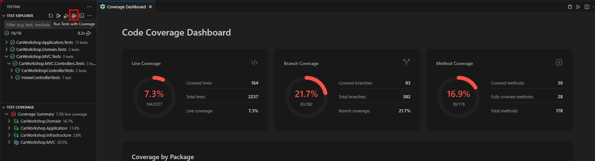
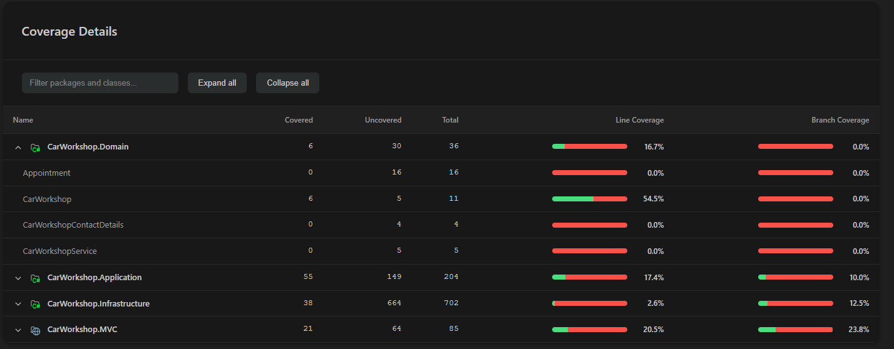

# Code Coverage Dashboard

Visualize and analyze code coverage metrics for your .NET tests with an interactive dashboard featuring real-time charts, risk analysis, and comprehensive coverage reports.

## Overview

The Code Coverage Dashboard provides a comprehensive view of your test coverage, helping you identify untested code, high-risk areas, and maintain quality standards across your .NET projects.

## Features

### Interactive Coverage Visualization

- **Circular Progress Indicators**: Real-time line and branch coverage percentages with visual gauges
- **Package Coverage Chart**: Bar chart showing coverage breakdown by project/package with customizable visibility
- **Risk Hotspots Table**: Identifies classes with high complexity and low coverage
- **Detailed Coverage Table**: Expandable hierarchical view of packages, classes, and methods

### Coverage Metrics

The dashboard tracks multiple coverage metrics:

- **Line Coverage**: Percentage of code lines executed by tests
- **Branch Coverage**: Percentage of conditional branches tested
- **Method Coverage**: Number of methods with test coverage
- **Complexity Analysis**: Cyclomatic complexity and CRAP index for risk assessment

## Accessing the Coverage Dashboard

### Run Tests with Coverage

1. Open the Test Explorer (Testing icon in Activity Bar)
2. Click the "Run All Tests with Coverage" button
3. Tests execute with coverage collection enabled
4. Coverage Dashboard opens automatically with results

### Alternative Methods

- **Command Palette**: `Ctrl+Shift+P` → "C# Dev Tools: Show Coverage Dashboard"
- **Context Menu**: Right-click test project → "Run Tests with Coverage"
- **Status Bar**: Click on coverage percentage indicator (when available)

## Understanding Coverage Metrics

### Line Coverage

Shows the percentage of executable code lines that were executed during test runs.

- **Green Badge (≥ 80%)**: Good coverage
- **Yellow Badge (50-79%)**: Medium coverage
- **Red Badge (< 50%)**: Poor coverage

**Example:**

```text
Lines Covered: 1,234 / 1,500 = 82.3%
```

### Branch Coverage

Measures how many decision points (if statements, loops, etc.) have been tested.

- **100%**: All branches tested (both true and false paths)
- **50%**: Only one path tested per decision
- **0%**: Decision point not tested

**Example:**
```csharp
// Branch coverage tracks both paths:
if (condition) {  // True path
    // Code here
} else {          // False path
    // Code here
}
```

### CRAP Index (Change Risk Anti-Patterns)

Identifies risky code by combining complexity and coverage:

```text
CRAP = complexity² × (1 - coverage)³ + complexity
```

**Risk Levels:**

- **Low (1-10)**: Safe to modify
- **Medium (11-30)**: Review before changes
- **High (31-60)**: High risk, needs tests
- **Critical (> 60)**: Dangerous to modify without tests

## Coverage Dashboard Sections



### 1. Summary Cards

At the top of the dashboard, you'll find three circular progress cards:

#### Line Coverage Card

- Visual progress circle
- Percentage display
- Covered/Total lines ratio
- Detailed statistics

#### Branch Coverage Card

- Visual progress circle
- Percentage display
- Covered/Total branches ratio
- Detailed statistics

#### Method Coverage Card

- Visual progress circle
- Percentage display
- Methods with coverage
- Total method count

### 2. Coverage by Package Chart

Interactive bar chart showing coverage by project/package:

- **Hover**: View exact coverage percentages
- **Legend**: Shows which projects are displayed
- **Project Visibility Controls**: Checkboxes below chart to show/hide specific projects
- **Color Coding**: Projects colored by coverage level (green/yellow/red)

**Using Visibility Controls:**

1. Locate checkboxes below the chart
2. Uncheck projects you want to hide
3. Chart updates immediately
4. Re-check to show projects again

### 3. Risk Hotspots

Table highlighting high-risk classes that need attention:


| Column | Description |
|--------|-------------|
| **Class** | Class name and package |
| **Methods** | Number of methods in class |
| **Complexity** | Total cyclomatic complexity |
| **Line Coverage** | Percentage with badge |
| **Branch Coverage** | Percentage with badge |
| **CRAP Index** | Risk score |
| **Risk** | Risk level badge |
| **Actions** | Create Test button |

**Features:**

- **Pagination**: Navigate through hotspots (5 per page)
- **Click Row**: Opens class in editor at first method
- **Create Test**: Opens test generation dialog for the class
- **Sorting**: Automatically sorted by CRAP index (highest risk first)

### 4. Coverage Details Table

Comprehensive hierarchical view of all coverage data:



**Structure:**

- **Packages** (Projects) - Top level
  - **Classes** - Expandable
    - **Methods** - Individual coverage

**Features:**

- **Search/Filter**: Filter by package or class name
- **Expand/Collapse**: "Expand all" and "Collapse all" buttons
- **Click Navigation**: Click any item to open in editor
- **Detailed Metrics**: Shows covered/uncovered/total lines

**Column Details:**

- Name
- Covered lines
- Uncovered lines
- Total lines
- Line coverage %
- Branch coverage %

## Creating Tests from Coverage

### From Risk Hotspots

When you identify a high-risk class:

1. Locate the class in Risk Hotspots table
2. Click the "Create Test" button (test tube icon)
3. Test Generation dialog opens
4. Configure test settings:
   - Select test project
   - Choose test framework (xUnit, NUnit, MSTest)
   - Select assertion library
   - Enable AI-powered generation
5. Click "Generate Tests"
6. Tests are created for the class

### Recommended Workflow

1. **Review Hotspots**: Start with Critical and High risk classes
2. **Create Tests**: Use Create Test button for quick access
3. **Run Tests**: Execute new tests to verify
4. **Re-run Coverage**: Check improved metrics
5. **Iterate**: Continue until risk is acceptable

## Solution-Level Coverage

### Optimized Test Execution

The coverage system uses optimized solution-level test execution:

- **Single Command**: Runs `dotnet test` once for entire solution
- **Fast Execution**: Eliminates per-project overhead
- **Automatic Merging**: Combines coverage from all projects
- **Accurate Results**: Proper line-by-line hit aggregation

### Coverage Report Merging

When multiple test projects exist:

1. Each project generates its own coverage report (Cobertura XML)
2. Extension automatically detects all reports
3. Reports are merged using intelligent aggregation:
   - Line hits are summed across projects
   - Branch coverage is combined
   - Coverage percentages recalculated
4. Merged report displayed in dashboard


### Excluding Code from Coverage

Exclude specific code using attributes:

```csharp
[ExcludeFromCodeCoverage]
public class AutoGeneratedClass
{
    // This class is excluded from coverage
}

[ExcludeFromCodeCoverage]
public void HelperMethod()
{
    // This method is excluded
}
```

## Interpreting Results

### Good Coverage Indicators

✓ **Line coverage ≥ 80%**: Solid foundation  
✓ **Branch coverage ≥ 70%**: Edge cases tested  
✓ **CRAP index < 30**: Low modification risk  
✓ **Few red hotspots**: Risk is manageable  

### Warning Signs

⚠ **Line coverage < 60%**: Insufficient testing  
⚠ **Branch coverage < 50%**: Missing edge cases  
⚠ **CRAP index > 60**: Dangerous to modify  
⚠ **Many critical hotspots**: High project risk  

### Priority Actions

1. **Address Critical Hotspots First**: Highest CRAP index
2. **Test Complex Code**: High complexity, low coverage
3. **Cover Branches**: Improve decision point testing
4. **Maintain Coverage**: Don't let it decrease

## Best Practices

### Effective Coverage Testing

1. **Run Coverage Regularly**: After each feature or sprint
2. **Set Coverage Goals**: Aim for 80%+ line coverage
3. **Focus on Risk**: Prioritize high CRAP index classes
4. **Test Branches**: Ensure all decision paths tested
5. **Exclude Generated Code**: Keep metrics meaningful

### Recommended Workflow

```text
1. Run All Tests with Coverage
   ↓
2. Review Coverage Dashboard
   ↓
3. Identify Risk Hotspots
   ↓
4. Create Tests for High-Risk Classes
   ↓
5. Run Tests Again
   ↓
6. Verify Improved Coverage
   ↓
7. Commit Changes
```


## Integration with Other Features

### Test Generation

- Create tests from Risk Hotspots table
- AI-powered test creation for low-coverage classes
- See [Test Generation](./test-generation.md)

### Test Explorer

- Run tests with coverage from Test Explorer
- View coverage status in test tree
- See [Running and Debugging Tests](./running-debugging-tests.md)

### Solution Explorer

- Right-click test projects → "Run Tests with Coverage"
- Access coverage from project context menu
- See [Solution Explorer](../solution-explorer/)

## Advanced Features

### Inline Editor Decorations

Coverage indicators appear directly in your code editor:


Features:

- **Covered Lines**: Green background highlighting
- **Uncovered Lines**: Red background highlighting
- **Toggle On/Off**: Use command palette or coverage dashboard
- **Real-time Updates**: Automatically refresh after test runs
- **Multi-file Support**: Works across all C# files in solution

To toggle decorations:

1. Open Command Palette (Ctrl+Shift+P)
2. Search for "Toggle Test Coverage Decorations"
3. Or use the toggle button in the coverage dashboard

### Custom Coverage Thresholds

Edit coverage thresholds by modifying source:

- Good: ≥ 80% (green)
- Medium: 50-79% (yellow)
- Poor: < 50% (red)

### Export Coverage Data

Coverage data stored in Cobertura XML format:

```text
TestResults/
  {guid}/
    coverage.cobertura.xml
```

Can be used with:

- CI/CD pipelines
- Coverage reporting tools
- Code quality platforms
- Historical analysis tools

### Coverage Trends

Track coverage over time:

1. Save coverage reports after each run
2. Compare reports to see improvements
3. Use external tools for trend visualization
4. Set up alerts for coverage drops

## Related Documentation

- [Running and Debugging Tests](./running-debugging-tests.md) - Test execution basics
- [Test Generation](./test-generation.md) - Create tests with AI
- [SpecFlow Support](./specflow-support.md) - BDD testing coverage
- [Playwright Integration](./playwright-integration.md) - E2E test coverage

## Additional Resources

- [Coverlet Documentation](https://github.com/coverlet-coverage/coverlet)
- [Cobertura Coverage Format](https://cobertura.github.io/cobertura/)
- [CRAP Metric Explained](http://www.artima.com/weblogs/viewpost.jsp?thread=210575)
- [Code Coverage Best Practices](https://martinfowler.com/bliki/TestCoverage.html)
