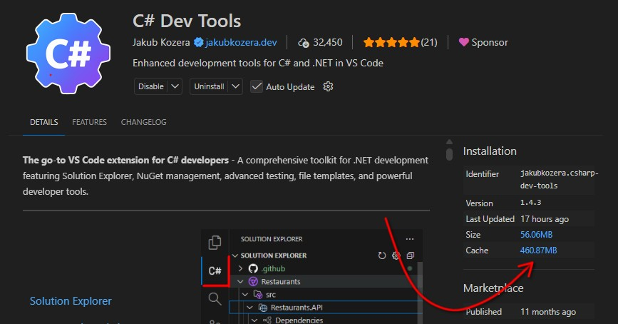

If your network environment blocks access to GitHub (e.g., corporate firewall restrictions), you can manually download and install the Language Server component required by C# Dev Tools.

## Why Manual Installation?

C# Dev Tools automatically downloads its Language Server component from GitHub on first activation. If this download fails due to network restrictions, you'll need to install it manually.

## Step 1: Download the Language Server

Download the appropriate zip file for your platform from the [GitHub Releases page](https://github.com/jakubkozera/vsc-csharp-dev-tools/releases):

| Platform | Architecture | Download File |
|----------|--------------|---------------|
| Windows | x64 | `csharp-dev-tools-lsp-win-x64.zip` |
| Windows | ARM64 | `csharp-dev-tools-lsp-win-arm64.zip` |
| Linux | x64 | `csharp-dev-tools-lsp-linux-x64.zip` |
| Linux | ARM64 | `csharp-dev-tools-lsp-linux-arm64.zip` |
| macOS | Intel (x64) | `csharp-dev-tools-lsp-osx-x64.zip` |
| macOS | Apple Silicon (ARM64) | `csharp-dev-tools-lsp-osx-arm64.zip` |


## Step 2: Locate the Installation Directory

The easiest way to find the correct folder — regardless of whether you're using VS Code, VS Code Insiders, Cursor, or any other fork:

1. Open the **Extensions** view (`Ctrl+Shift+X` / `Cmd+Shift+X`)
2. Search for **C# Dev Tools** and click on it to open the extension details
3. In the right-hand **Installation** panel, click the **Cache** size link (e.g. `460.87MB`) — this opens the extension's cache folder in your file explorer



4. Inside that folder, create a new subfolder named **`lsp`** — this is where you will extract the downloaded files

## Step 3: Extract the Files

1. Create the `lsp` folder if it doesn't exist
2. Extract the contents of the downloaded zip file into the `lsp` folder
3. After extraction, your folder structure should look like this:

```
lsp/
├── LanguageServer/
│   ├── CsharpDevTools.exe (or CsharpDevTools on Linux/macOS)
│   └── ... (other files)
├── DebuggerMono/
│   └── ... (debugger files)
├── NotebookHost/
│   └── ... (notebook host files)
└── version.txt
```

## Step 4: Create Version Marker

Create a `version.txt` file in the `lsp` folder containing the version number you downloaded (e.g., `1.4.1`):

### Windows (PowerShell)

```powershell
echo "1.4.1" > "$env:APPDATA\Code\User\globalStorage\jakubkozera.csharp-dev-tools\lsp\version.txt"
```

### macOS / Linux

```bash
echo "1.4.1" > ~/Library/Application\ Support/Code/User/globalStorage/jakubkozera.csharp-dev-tools/lsp/version.txt
```

:::caution
Replace `1.4.1` with the actual version number you downloaded.
:::

## Step 5: Set Executable Permissions (Linux/macOS only)

On Linux and macOS, you need to make the server binaries executable:

```bash
chmod +x ~/Library/Application\ Support/Code/User/globalStorage/jakubkozera.csharp-dev-tools/lsp/LanguageServer/CsharpDevTools
chmod +x ~/Library/Application\ Support/Code/User/globalStorage/jakubkozera.csharp-dev-tools/lsp/DebuggerMono/monodbg
```

Adjust the path for Linux:
```bash
chmod +x ~/.config/Code/User/globalStorage/jakubkozera.csharp-dev-tools/lsp/LanguageServer/CsharpDevTools
chmod +x ~/.config/Code/User/globalStorage/jakubkozera.csharp-dev-tools/lsp/DebuggerMono/monodbg
```

## Step 6: Restart VS Code

Restart VS Code completely (close all windows) to ensure the extension picks up the manually installed Language Server.

## Verifying Installation

After restarting VS Code:

1. Open a folder containing a C# solution
2. Open the Output panel (`Ctrl+Shift+U` / `Cmd+Shift+U`)
3. Select "C# Dev Tools" from the dropdown
4. You should see messages indicating the Language Server is starting

## Updating

When updating the extension, you may need to repeat this process if the required Language Server version changes. The extension will attempt to download the new version automatically, but if that fails, download the matching version from GitHub and repeat the extraction steps.

## Troubleshooting

### Extension Still Tries to Download

If the extension still attempts to download after manual installation:

1. Verify the `version.txt` file exists and contains the correct version
2. Check that the folder structure matches the expected layout
3. Ensure file permissions allow VS Code to read the files

### Permission Denied Errors

On Linux/macOS, ensure the binary files are executable (see Step 5).

### Wrong Architecture

If you see errors about invalid executables, verify you downloaded the correct platform/architecture combination for your system.

---

For additional help, open an issue on [GitHub](https://github.com/jakubkozera/vsc-csharp-dev-tools/issues).
