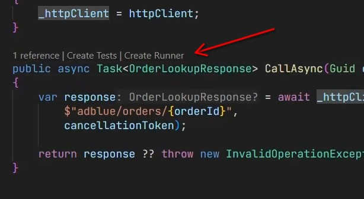
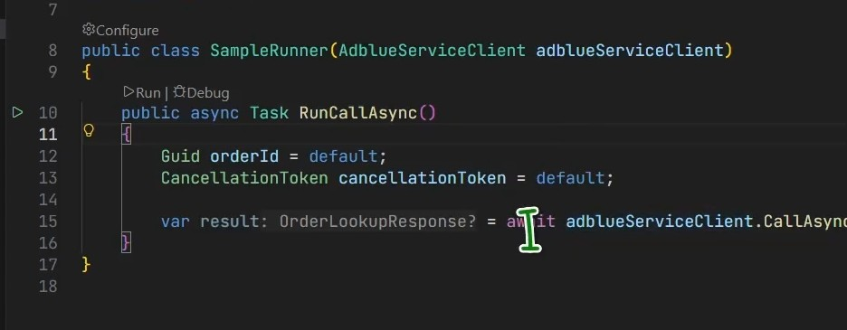
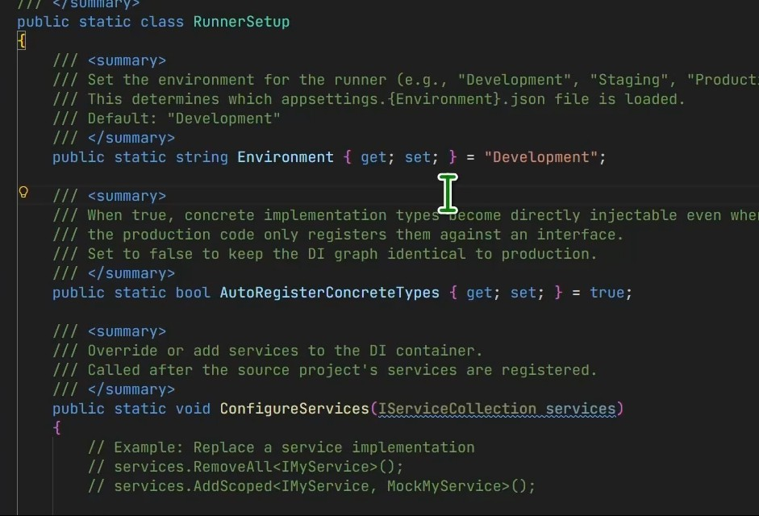
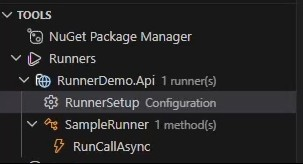

Run or debug a specific method in isolation — without starting your entire application — using C# Runners.

## Overview

C# Runners let you create lightweight entry points for individual methods inside projects that use the .NET dependency injection (DI) container. Instead of spinning up the whole API, preparing payloads, and routing a request through every middleware layer, you create a **Runner** that wires up the DI container and calls the method directly.

> **Prerequisite**: Runners are only supported for projects that contain a `Program.cs` file and use the .NET generic host / DI container (`IServiceCollection`). Console apps, Web APIs, Worker Services, and similar host-based projects are all supported.

## Video Tutorial

  <iframe
    width="100%"
    height="420"
    style="height: 420px;"
    src="https://www.youtube.com/embed/qnWzkcfa-fo"
    title="C# Runners tutorial"
    frameborder="0"
    allow="accelerometer; autoplay; clipboard-write; encrypted-media; gyroscope; picture-in-picture; web-share"
    referrerpolicy="strict-origin-when-cross-origin"
    allowfullscreen>
  </iframe>

▶ [Watch the full C# Runners tutorial on YouTube](https://youtu.be/qnWzkcfa-fo)

## How It Works

When you create a Runner the extension:

1. Creates a separate **runner project** (not added to your solution, not committed to source control) next to your source project.
2. Generates a **runner class** that imports your project's DI configuration from `Program.cs` and injects the required service into its constructor.
3. Provides a `Run()` method where you fill in the parameters and call the target method.
4. Registers a **run / debug** code lens on the runner class so you can launch it with one click.

The runner project reuses your existing `appsettings.{Environment}.json` files, which means real configuration values (including environment-specific secrets) are available at debug time.

## Creating a Runner

### From the CodeLens in the Editor

The fastest way to create a runner is directly from the source file containing the method you want to test:

1. Open a C# file in a DI-based project
2. Click the **Create Runner** CodeLens that appears above the class or method

3. Enter a name for the runner when prompted
4. The extension generates the runner file and opens it automatically

### From the Tools Panel

1. Open the **C# Dev Tools** sidebar
2. Expand **Tools** → **Runners**
3. Click the **+** (Create Runner) button

## Working with Runners

Once created, the runner file is ready to use:

- The target service is **automatically injected** into the runner's constructor based on your DI registration.
- The `Run()` method is a plain C# method — add parameters, helper variables, `Console.WriteLine` calls, or breakpoints just as in any other file.
- Full **C# LSP support** is available: hover info, go to definition, quick fixes, and IntelliSense all work normally.
- The runner file is **not tracked by source control** (the runner project is excluded from the solution and placed outside the repository tree).

### Setting Breakpoints

Add a breakpoint anywhere in the runner file or in the code it calls, then click **Debug** from the code lens. The debugger attaches just like a normal launch.

## Runner Configuration

Each runner has its own configuration panel:

| Setting | Description |
|---|---|
| **Environment** | Controls which `appsettings.{Environment}.json` is loaded. Defaults to `Development`; change to `Production` to use production config values. |
| **Auto Register Concrete Types** | When enabled, concrete types can be injected directly into the runner even if only their interface is registered in the DI container. |
| **Configure Services** | A hook method where you can add, replace, or remove DI registrations before the runner executes — useful for mocking dependencies. |

### Accessing Configuration

- Click the **Configure** code lens that appears at the top of the runner file, or
- Open **Tools** → **Runners** in the sidebar and click the settings icon next to the runner.

## Runner Explorer

All runners are visible in the **Runner Explorer** section of the Tools panel:

From the Runner Explorer you can:

- See all runners grouped by source project
- Run or debug any runner with one click
- Open the runner configuration
- Delete a runner

## When to Use Runners

| Scenario | Benefit |
|---|---|
| Debugging a service deep in the DI graph | No need to set up HTTP requests, authentication, or test data pipelines |
| Verifying integration with a real database / API | Load real credentials via `appsettings.Production.json` in isolation |
| Reproducing a bug from production | Replay exact inputs without the full application stack |
| Rapid iteration on business logic | Edit → Run cycle is faster than starting the whole host |

## Limitations

- Requires a `Program.cs` that configures `IServiceCollection` (generic host pattern).
- Projects that do **not** use a DI container (e.g. plain class libraries or legacy `Main()` apps without the generic host) are not supported.
- The generated runner project is excluded from source control and is not added to the `.sln` file.
